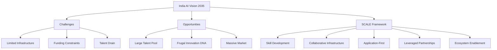
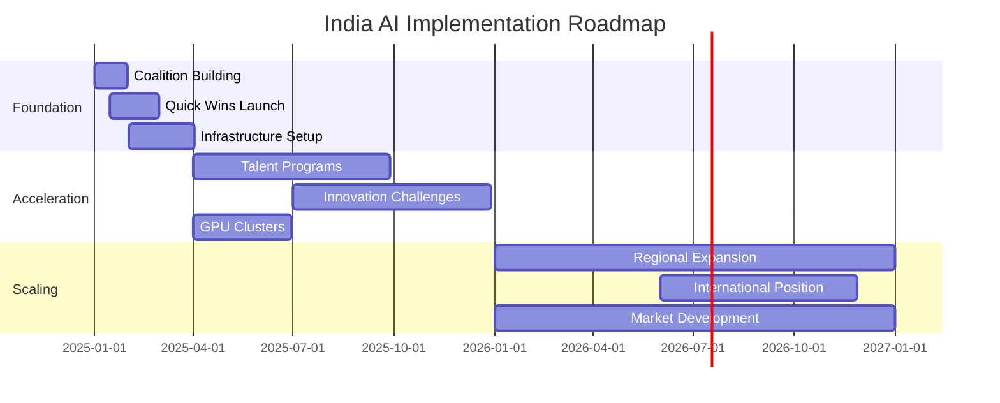
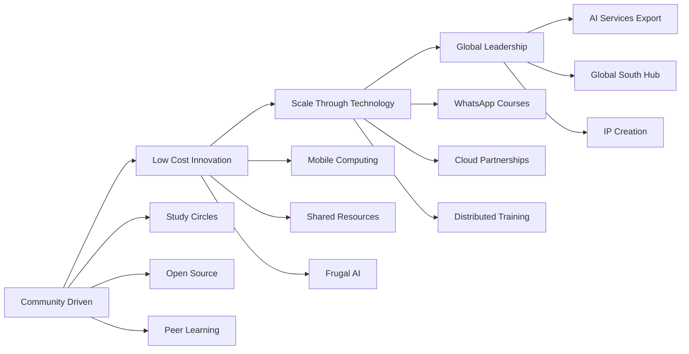
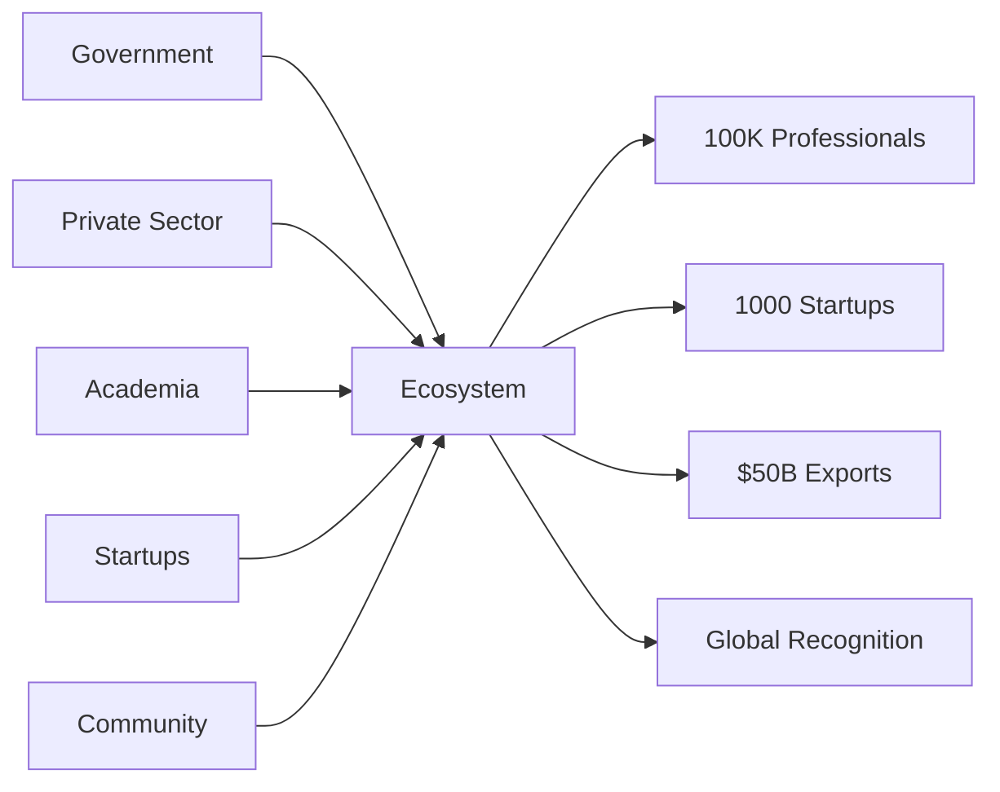
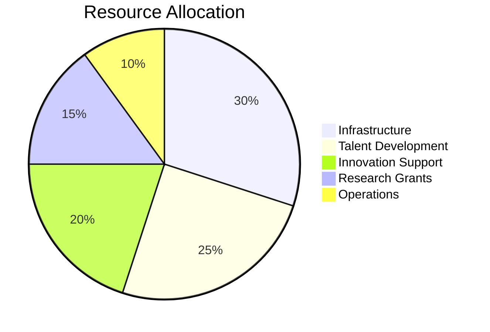
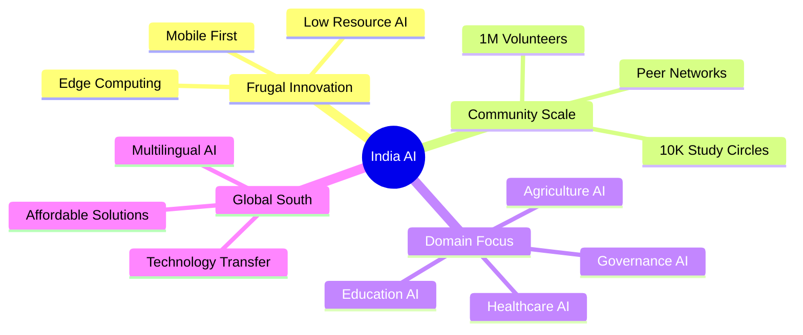
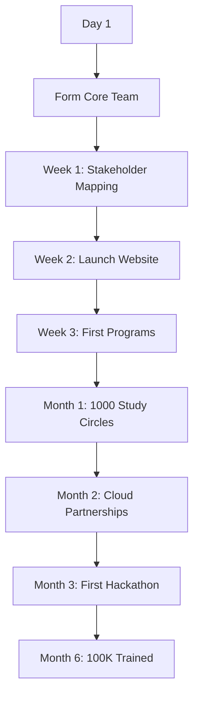

# India AI Strategy Visual Summary

## Strategic Overview

## Implementation Timeline

## Ecosystem Building Approach

## Stakeholder Ecosystem

## Investment Model

## Success Metrics Dashboard

| Metric | Year 1 Target | Year 5 Target | Year 10 Target |
|--------|---------------|---------------|----------------|
| AI Professionals | 100,000 | 500,000 | 1,000,000 |
| AI Startups | 500 | 5,000 | 10,000 |
| Investment Mobilized | ₹1,000 Cr | ₹50,000 Cr | ₹2,00,000 Cr |
| AI Exports | $100M | $10B | $50B |
| Government AI Projects | 50 | 500 | 2,000 |
| Global Ranking | Top 20 | Top 10 | Top 3 |

## Key Differentiators

## Risk Mitigation Matrix

| Risk | Impact | Mitigation Strategy |
|------|--------|-------------------|
| Talent Drain | High | Create compelling local opportunities, competitive pay |
| Infrastructure Gap | High | Distributed computing, cloud partnerships |
| Funding Shortage | Medium | Multiple sources, CSR, international aid |
| Technology Lag | Medium | Focus on applications, open source |
| Execution Delays | Medium | Professional PMO, agile approach |

## Quick Start Actions

## Contact Points

- **Leadership**: ai-leadership@india.gov.in
- **Partnerships**: partnerships@aiforindia.org
- **Volunteers**: volunteer@aiforindia.org
- **Startups**: startup@aiforindia.org
- **Media**: media@aiforindia.org

## Join the Movement

### For Individuals
- Join a study circle
- Contribute to open source
- Become a mentor
- Start learning today

### For Organizations
- Partner with us
- Sponsor programs
- Share infrastructure
- Hire AI talent

### For Government
- Implement AI solutions
- Open data sets
- Policy support
- Fund initiatives

---

**Together, we can make India a global AI powerhouse through innovation, collaboration, and scale.**

#AIForIndia #DigitalIndia #FrugalInnovation
